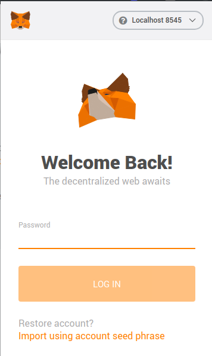
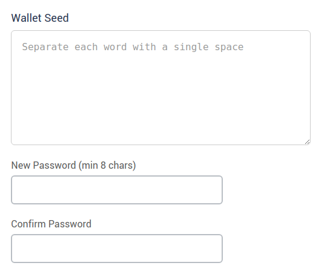
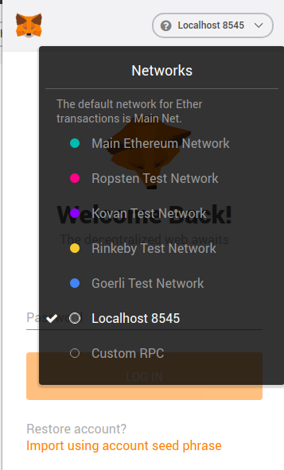
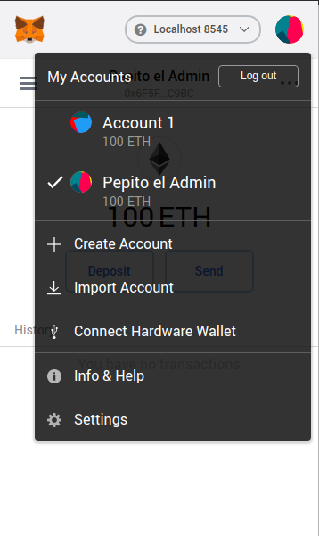
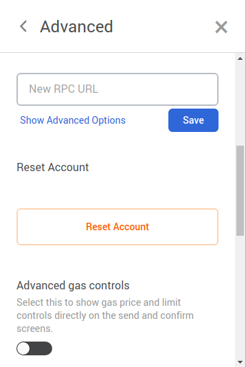

## Setup your Metamask extension to work with this dApp

### Install Metamask
This dApp is tested with the Metamask extension on a Chrome browser with version +75.x. To make sure you can 
successfully run this dApp, make sure you are using this browser with a matching version.

Now access your Chrome Metamask from the Chrome Store.

### Configure Metamask
Follow the steps behind:
* Start the backend server following the docs contained in [this repo](https://bitbucket.i2cat.net/projects/BHDA/repos/backend/browse).
* Start the React development server by following the documentation contained in this repo and running 
`npm start` once the development environment has been correctly set up.
* Open Markdown and click the `import using account seed phrase` link.

* You will be directed to the following page where you shall input the exact same seed phrase that is contained in the environment
variables file of your backend repo. Also you need to set a password that you **must remember**.

* You're ready to go, only one small detail missing: change the environment of the blockchain to work with to the local 
development one deployed in http://localhost:8545/

.

You can now add users by including their private keys (shown in the console during the deployment script) to your Metamask 
session.

### Reset your Metamask testnet in order to avoid conflicts with freshly instantiated ganache blockchains.
* Access your account dialog:  
.

* Go to settings and in the menu click the `Advanced` tab, then scroll down to `Reset Account`:  
.

